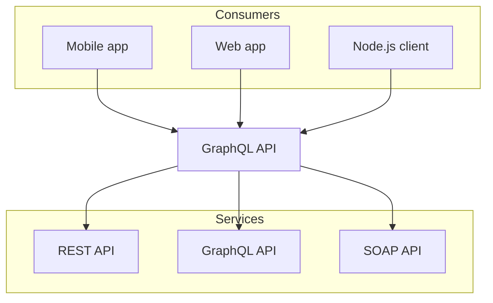

# Satori

Satori (悟り) is a Japanese Buddhist term for awakening, "comprehension; understanding".

# Mermaid


```mermaid
graph TD;
subgraph AA [Consumers]
A[Mobile app];
B[Web app];
C[Node.js client];
end
subgraph BB [Services]
E[REST API];
F[GraphQL API];
G[SOAP API];
end
Z[GraphQL API];
A --> Z;
B --> Z;
C --> Z;
Z --> E;
Z --> F;
Z --> G;
```

# Npm2Yarn

```sh npm2yarn
npm i -D @graphql-eslint/eslint-plugin
```
